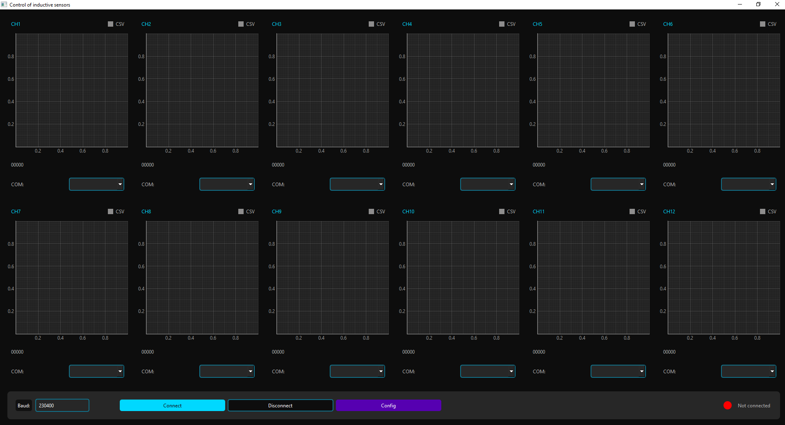

# LDC Sensor Hub

## Repository Description (About)
Аппаратно-программный комплекс на 12 индуктивных датчиков (LDC) с графическим интерфейсом для ПК. Система включает основную плату с микроконтроллером, до 12 сенсорных модулей с печатными катушками и кроссплатформенный GUI для конфигурации, визуализации и записи данных в реальном времени. Предназначена для тестирования, настройки и анализа различных вариантов индуктивных катушек.

## Подробное описание проекта
Данный проект представляет собой законченный аппаратно-программный комплекс (АПК) для работы с 12 индуктивными датчиками на базе LDC-чипов, предназначенный для измерений, тестирования и анализа параметров индуктивных катушек.

Система состоит из основной управляющей платы с микроконтроллером и 12 подключаемых сенсорных плат, каждая из которых содержит печатную катушку. Катушки выполнены в виде отдельных печатных плат с разъёмом и контактной площадкой под колпачок типоразмера 0603, что позволяет легко заменять катушки и проводить эксперименты с различной геометрией и параметрами печатных плат без изменения основной электроники.

Микроконтроллер управляет всеми LDC-чипами, осуществляет сбор данных и передаёт их на ПК по интерфейсу USB–UART. Прошивка поддерживает потоковый режим работы (LiveStream), при котором данные со всех 12 каналов передаются в реальном времени, а также предоставляет полный доступ к конфигурационным регистрам LDC-чипов.

Для работы с системой разработан кроссплатформенный графический интерфейс на Python (PyQt5 + matplotlib). GUI позволяет:

- отображать данные до 12 каналов в реальном времени;
- включать и отключать отдельные графики;
- настраивать параметры LDC-чипов напрямую из интерфейса;
- записывать измерения в CSV-файлы для последующего анализа;
- работать как с онлайн-данными, так и с сохранёнными логами (при необходимости).

Проект ориентирован на разработчиков и инженеров, занимающихся сенсорными системами, индуктивными измерениями и экспериментальной электроникой, и может быть использован как платформа для исследований, прототипирования и отладки индуктивных датчиков.

## Состав проекта
- `Programm.exe` — готовое приложение для Windows.
- `Programm.rar` — архив с приложением.
- `Instruction.pdf` / `Инструкция.pdf` — инструкции пользователя.
- `Документация/` — технические документы и даташиты.
- `Image/` — изображения обложки.

## Быстрый запуск
1. Подключите устройство по USB–UART.
2. Запустите `Programm.exe`.
3. Следуйте инструкциям в `Instruction.pdf` / `Инструкция.pdf`.

## Системные требования
- Windows 10/11
- USB–UART подключение к основной плате

## Лицензия
Лицензия не указана. Все права защищены, если не указано иное.

## Хештеги
#LDC #InductiveSensors #Hardware #DAQ #PyQt5 #Matplotlib #Electronics #SensorHub #Embedded #Instrumentation
